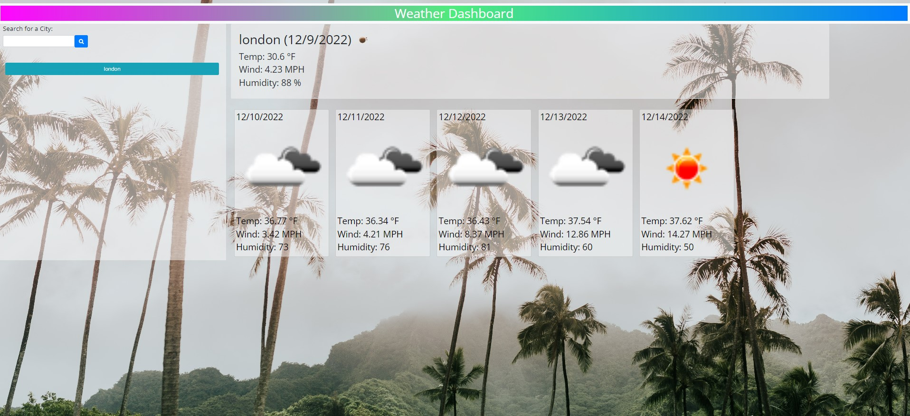
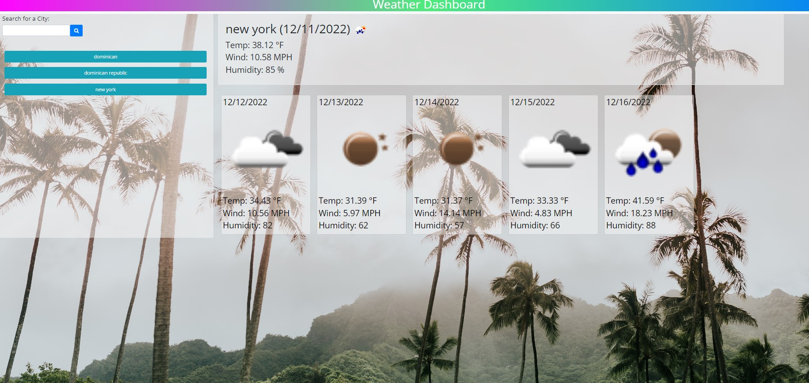

## 06 Weather Forecast

## Description

a weather application that allows the user to search any city name and find out the weather at the current time and the forecast for the next 5 days and it also saves their search history so they can just click on the searched city next time.

## AS A traveler

I WANT to see the weather outlook for multiple cities
SO THAT I can plan a trip accordingly

## Acceptance Criteria

GIVEN a weather dashboard with form inputs
WHEN I search for a city
THEN I am presented with current and future conditions for that city and that city is added to the search history
WHEN I view current weather conditions for that city
THEN I am presented with the city name, the date, an icon representation of weather conditions, the temperature, the humidity, and the the wind speed
WHEN I view future weather conditions for that city
THEN I am presented with a 5-day forecast that displays the date, an icon representation of weather conditions, the temperature, the wind speed, and the humidity
WHEN I click on a city in the search history
THEN I am again presented with current and future conditions for that city

Deployed link: https://hovigmk.github.io/Weather-Forecast/

Repository link: https://github.com/hovigmk/Weather-Forecast

Screenshots:

